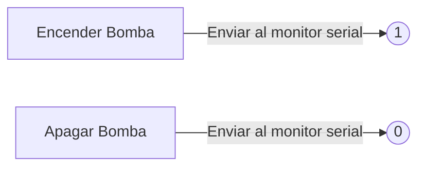
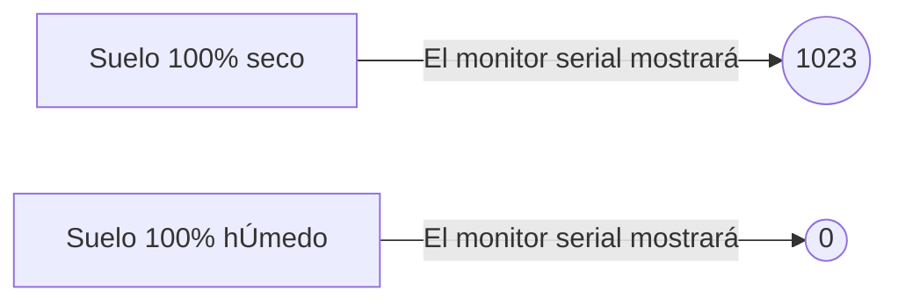

# **Startup-ARD-01**
**MÓDULO RELÉ**
Código del funcionamiento del módulo relé a través del monitor serial, con Arduino:

#
**MÓDULO SENSOR DE HUMEDAD DEL SUELO**
Código del funcionamiento del módulo de humedad del suelo a través del monitor serial, con Arduino:

#